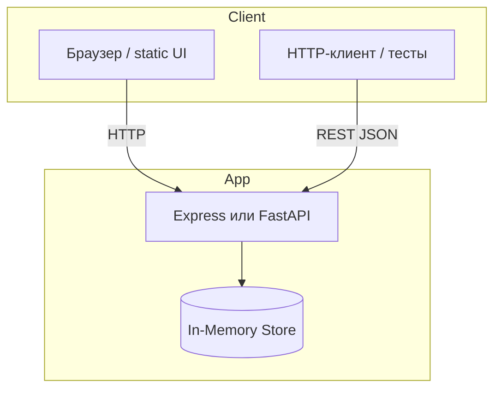
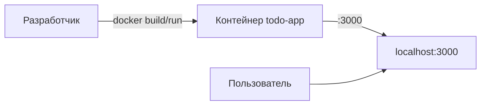
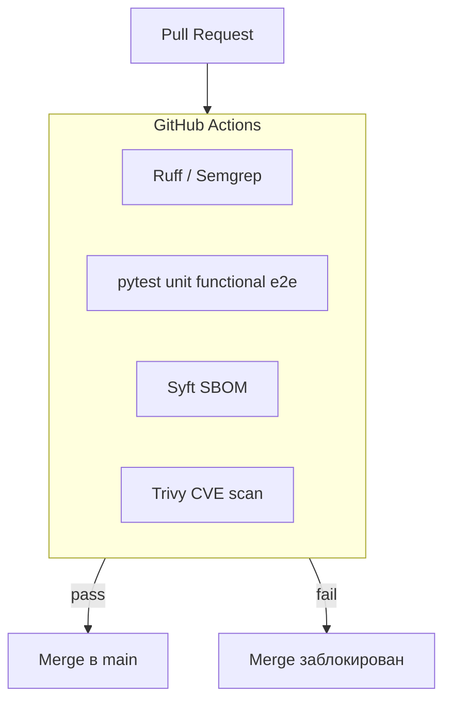
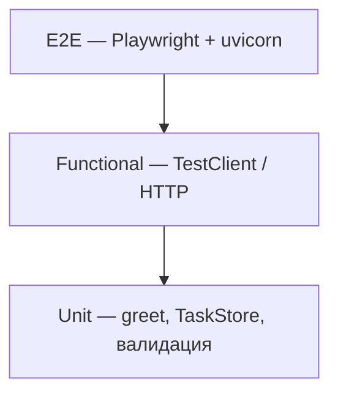

# Финальный отчёт: система управления задачами (Task Manager)

**Репозиторий:** `introduction-to-the-specialty`  
**Автор:** студент курса «Введение в специальность»  
**Версия документа:** 1.0  
**Дата:** 2026

---

## Содержание

1. [Краткое резюме](#1-краткое-резюме)
2. [Описание системы](#2-описание-системы)
3. [Архитектура](#3-архитектура)
4. [Этапы разработки](#4-этапы-разработки)
5. [Тестирование](#5-тестирование)
6. [Безопасность](#6-безопасность)
7. [CI/CD и качество](#7-cicd-и-качество)
8. [Эксплуатация](#8-эксплуатация)
9. [Выводы](#9-выводы)
10. [Приложения](#10-приложения)

---

## 1. Краткое резюме

В рамках серии домашних заданий (dz_2–dz_7) спроектирован и поэтапно доработан **веб-сервис управления задачами (To-Do / Task Manager)** с REST API и простым UI.

Проект прошёл путь от прототипа на Node.js до контейнеризации, автоматических проверок в CI, многоуровневого тестирования, статического анализа безопасности и сканирования зависимостей.

**Ключевой результат:** репозиторий, который можно передать другому разработчику: есть код, Docker, pipelines, тесты и документированные практики безопасности.

---

## 2. Описание системы

### 2.1 Назначение

Система позволяет:

- создавать задачи с названием и описанием;
- просматривать список с фильтрацией (все / активные / выполненные);
- отмечать задачи выполненными, редактировать и удалять;
- обращаться к API программно (интеграции, тесты).

### 2.2 Пользователи и сценарии

| Роль | Сценарий |
|------|----------|
| Пользователь (браузер) | Открывает UI, добавляет задачи, меняет статус |
| Клиент API | `GET/POST/PUT/DELETE /api/tasks` |
| Разработчик | Локальный запуск, Docker, pytest, Semgrep, Trivy |
| CI (GitHub Actions) | Автоматические проверки на Pull Request |

### 2.3 Реализации в репозитории

В репозитории сохранены **несколько эволюционных веток** одной предметной области:

| Папка | Стек | Назначение |
|-------|------|------------|
| `dz_2/` | Node.js + Express | Исходное приложение (REST + `public/index.html`) |
| `dz_4/` | Node.js в Docker | То же приложение, упакованное в контейнер |
| `dz_5/` | Python + FastAPI | API задач + UI; **основа для тестов** |
| `dz_3/` | Python | Модуль `greet` + CI (lint/format) |
| `dz_6/` | Python + FastAPI | Демонстрация secure coding + Semgrep |
| `dz_7/` | Python + FastAPI | Демонстрация SBOM/Trivy для зависимостей |

**Рекомендуемая точка входа для изучения:** `dz_5` (функциональность + тесты) и `dz_4` (деплой в Docker).

### 2.4 Пример API (dz_5 / dz_2)

```http
GET  /api/tasks?filter=active
POST /api/tasks          {"title": "Сдать отчёт", "description": "dz_8"}
PUT  /api/tasks/{id}     {"title": "...", "completed": true}
DELETE /api/tasks/{id}
```

Ответ `201` при создании, `404` если задача не найдена, `400` при пустом названии.

---

## 3. Архитектура

### 3.1 Логическая схема



Данные хранятся **в памяти процесса** (прототип; при перезапуске список сбрасывается). Для production в `dz_6` показан вариант с SQLite и параметризованными запросами.

### 3.2 Физическое развёртывание (dz_4)



Dockerfile: multi-stage (`deps` → `runner`), образ `node:22-alpine`, непривилегированный пользователь `app`.

### 3.3 Pipeline качества и безопасности



### 3.4 Структура репозитория

```
introduction-to-the-specialty/
├── dz_2/          # Node To-Do (исходник)
├── dz_3/          # CI: lint, format, pytest
├── dz_4/          # Docker
├── dz_5/          # Тесты: unit / functional / e2e
├── dz_6/          # Semgrep SAST
├── dz_7/          # Syft + Trivy
├── dz_8/          # Этот отчёт
└── .github/workflows/
    ├── ci.yml
    ├── dz5-tests.yml
    ├── dz6-semgrep.yml
    └── dz7-sbom-trivy.yml
```

---

## 4. Этапы разработки

| № | ДЗ | Цель | Результат | Артефакты |
|---|-----|------|-----------|-----------|
| 1 | **dz_2** | Базовое приложение | REST API + SPA в одном `server.js` | `dz_2/server.js`, `public/index.html` |
| 2 | **dz_3** | CI / quality gate | GitHub Actions: Ruff lint, format, pytest | `.github/workflows/ci.yml` |
| 3 | **dz_4** | Docker | Воспроизводимый запуск `docker build/run` | `dz_4/Dockerfile`, README |
| 4 | **dz_5** | Тестирование | Unit, functional (TestClient), e2e (Playwright) | `dz_5/tests/`, `dz5-tests.yml` |
| 5 | **dz_6** | SAST | Semgrep, исправления OWASP-типа | `dz_6/src/`, `semgrep-review.md` |
| 6 | **dz_7** | Зависимости | SBOM (Syft), CVE (Trivy), обновление pins | `dz_7/requirements.txt`, отчёт |
| 7 | **dz_8** | Документация | Финальный отчёт (этот документ) | `dz_8/docs/` |

### 4.1 Пример эволюции: запуск приложения

**Было (dz_2):**

```bash
cd dz_2 && npm install && npm start
# http://localhost:3000
```

**Стало (dz_4):**

```bash
cd dz_4
docker build -t todo-app:dz4 .
docker run --rm -p 3000:3000 todo-app:dz4
```

**Python-версия (dz_5):**

```bash
cd dz_5 && pip install -r requirements-dev.txt
uvicorn dz5.app:app --reload --port 8000
```

---

## 5. Тестирование

### 5.1 Стратегия (пирамида)



Снизу вверх: больше тестов unit, меньше e2e (классическая пирамида).

| Уровень | Где | Что проверяет | Запуск |
|---------|-----|---------------|--------|
| **Unit** | `dz_5/tests/unit/` | Бизнес-логика без I/O | `pytest -m unit` |
| **Functional** | `dz_5/tests/functional/` | REST: CRUD, фильтры, 400/404 | `pytest -m functional` |
| **E2E** | `dz_5/tests/e2e/` | UI + `fetch` в браузере | `pytest -m e2e` |

### 5.2 Примеры

**Unit** — валидация пустого имени:

```python
def test_greet_rejects_empty():
    with pytest.raises(ValueError):
        greet("   ")
```

**Functional** — жизненный цикл задачи через API:

```python
create = client.post("/api/tasks", json={"title": "Write tests"})
assert create.status_code == 201
```

**E2E** — добавление задачи через форму в браузере (`tests/e2e/test_ui.py`).

### 5.3 CI

Workflow `dz5-tests.yml` запускает три job'а на Pull Request; e2e выполняется после unit и functional.

### 5.4 Покрытие и ограничения

- Покрыт основной CRUD и ошибки валидации.
- Не покрыто: нагрузочное тестирование, персистентность БД (in-memory).
- Для dz_6 добавлены unit-тесты авторизации (`dz_6/tests/`).

---

## 6. Безопасность

### 6.1 Статический анализ (dz_6 — Semgrep)

| Проблема | Риск | Митигация в `dz_6/src/` |
|----------|------|-------------------------|
| Секреты в коде | Утечка в git | `API_KEY` из `os.environ` |
| SQL injection | Компрометация БД | Запросы с `?` плейсхолдерами |
| `eval()` на вводе | RCE | `json.loads()` |

Подробный разбор: [`dz_6/docs/semgrep-review.md`](../../dz_6/docs/semgrep-review.md).

Учебные уязвимые фрагменты: `dz_6/training/insecure_snippets.py` (исключены из CI через `.semgrepignore`).

### 6.2 Зависимости (dz_7 — Syft + Trivy)

| Этап | Инструмент | Выход |
|------|------------|-------|
| SBOM | Syft | CycloneDX JSON (артефакт CI) |
| CVE scan | Trivy | HIGH/CRITICAL → fail pipeline |

Пример устранения: обновление `urllib3` 1.x → 2.2.3, `requests` → 2.32.3 — см. [`dz_7/docs/vulnerability-report.md`](../../dz_7/docs/vulnerability-report.md).

### 6.3 Контейнер (dz_4)

- Минимальный образ Alpine.
- Пользователь без root (`USER app`).
- `.dockerignore` исключает `node_modules` с хоста.

### 6.4 Рекомендации для production

1. HTTPS, секреты в vault / GitHub Secrets.
2. Персистентная БД + миграции.
3. Rate limiting, CORS по whitelist.
4. Dependabot + регулярный Trivy на `main`.

---

## 7. CI/CD и качество

| Workflow | Триггер | Проверки |
|----------|---------|----------|
| `ci.yml` | `dz_3/**` | Ruff lint, format, pytest |
| `dz5-tests.yml` | `dz_5/**` | unit, functional, e2e |
| `dz6-semgrep.yml` | `dz_6/**` | Semgrep SAST, pytest |
| `dz7-sbom-trivy.yml` | `dz_7/**` | Syft SBOM, Trivy, pytest |

**Quality gate:** merge в `main` через Pull Request; при включённых branch rules — обязательные зелёные checks (см. `dz_3/README.md`).

**Сдача домашних:** ссылка на PR в таблице курса.

---

## 8. Эксплуатация

Краткая шпаргалка для нового разработчика — в [`ONBOARDING.md`](ONBOARDING.md).

### 8.1 Требования

- Git, Node.js 22+ (dz_2, dz_4) или Python 3.11+ (dz_3–dz_7)
- Docker Desktop (dz_4)
- Опционально: `semgrep`, `syft`, `trivy` — локально для dz_6–dz_7

### 8.2 Чеклист перед PR

```bash
# Python (dz_5)
cd dz_5 && pip install -r requirements-dev.txt && pytest -q

# Docker (dz_4)
cd dz_4 && docker build -t todo-app:dz4 . && docker run --rm -p 3000:3000 todo-app:dz4

# Security (dz_6, dz_7)
cd dz_6 && semgrep scan --config p/python src/
cd dz_7 && ./scripts/scan-deps.ps1   # Windows
```

---

## 9. Выводы

### 9.1 Технические

1. **Автоматизация** (CI) снижает риск сломать `main` и экономит время на ручных проверках.
2. **Тесты на разных уровнях** ловят разные классы ошибок: unit — логику, functional — контракт API, e2e — интеграцию UI.
3. **Безопасность** — не этап «в конце», а Semgrep в PR + Trivy для зависимостей.
4. **Docker** даёт одинаковое окружение у всех участников команды.

### 9.2 Процессные

- Документирование по ходу (README в каждом `dz_*`) упростило финальный отчёт.
- Отдельные папки под каждое ДЗ сохраняют историю обучения; в industry обычно одна кодовая база с ветками/feature flags.

### 9.3 Что улучшить дальше

- Объединить Node и Python прототипы в один сервис с общей БД.
- Добавить OpenAPI-клиент и контрактные тесты.
- Включить coverage gate (например, ≥ 80% на `dz_5/src`).
- Публикация SBOM в registry вместе с Docker-образом.

---

## 10. Приложения

### A. Ссылки на документацию модулей

| ДЗ | README |
|----|--------|
| dz_3 | [`dz_3/README.md`](../../dz_3/README.md) |
| dz_4 | [`dz_4/README.md`](../../dz_4/README.md) |
| dz_5 | [`dz_5/README.md`](../../dz_5/README.md) |
| dz_6 | [`dz_6/README.md`](../../dz_6/README.md) |
| dz_7 | [`dz_7/README.md`](../../dz_7/README.md) |

### B. Пример Pull Request

Формат сдачи: `https://github.com/<user>/introduction-to-the-specialty/pull/<N>`

### C. Глоссарий

| Термин | Определение |
|--------|-------------|
| **SBOM** | Software Bill of Materials — перечень компонентов сборки |
| **SAST** | Static Application Security Testing (Semgrep) |
| **Quality gate** | Условие «checks зелёные → можно merge» |
| **E2E** | End-to-end тест через UI как у пользователя |

---

*Документ подготовлен в рамках ДЗ 8. При передаче проекта начните с [ONBOARDING.md](ONBOARDING.md).*
